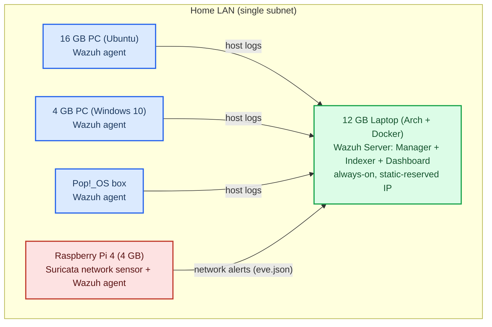

# Wazuh SOC Home Lab — Nazmus Sakib

**Owner:** Nazmus Sakib (23-52638-2) | AIUB BSc CSE Final Year  
**Started:** June 2026 | **Target completion:** Aug 31, 2026  
**Purpose:** Internship portfolio (SOC Analyst / Security Analyst) + Thesis foundation

---

## Project Goal

Build a functional Security Operations Center (SOC) home lab using Wazuh SIEM, demonstrating real-world threat detection, incident response, and detection engineering skills — entirely on personal hardware.

---

## Architecture



Host agents report endpoint logs; the Raspberry Pi runs Suricata for network-layer detection and forwards alerts to the same Wazuh server — two telemetry vantage points (host + network).

---

## Hardware Inventory

| Device | Role | Specs | Status |
|---|---|---|---|
| 12 GB Laptop (Arch) | Wazuh Server (SIEM), Docker | 12GB RAM, always-on | Rebuilding |
| PC 1 (Ubuntu) | Linux Agent | 16GB RAM, dual-boot | Enroll fresh |
| PC 2 | Windows Agent | 4GB RAM, Windows 10 | Enroll fresh |
| Pop!_OS box | Linux Agent | — | Enroll fresh |
| Raspberry Pi 4 | Network Sensor (Suricata) | 4GB RAM | Enroll fresh (Phase 7) |

> The original Wazuh server (a VirtualBox VM) was decommissioned 2026-06-16; the lab is being rebuilt fresh on the always-home laptop via Docker. See `docs/Server_Migration_Runbook.md`.

---

## Phase Overview

| Phase | Focus | Status | Target |
|---|---|---|---|
| Phase 0 | Environment Setup | Done | Done |
| Phase 1 | Wazuh Deployment | Done | Done |
| Phase 2 | Log Ingestion (4 nodes) | Done | Done |
| Phase 3 | Threat Simulation | In Progress | June 28 |
| Phase 4 | Detection Engineering | Not started | July 18 |
| Phase 5 | Investigation Playbooks | Not started | Aug 1 |
| Phase 6 | Portfolio Documentation | Not started | Aug 20 |
| Phase 7 | Raspberry Pi — Network Sensor | In Progress | June 21 |

> RPi moved from Phase 7 to run in parallel with Phase 3 — device available now.

---

## Folder Structure

```
cyber-security-soc-lab/
├── README.md                          ← this file
├── PROJECT_STATUS.md                  ← current progress tracker
├── .github/workflows/validate.yml     ← CI: rule-XML + glyph + key-doc checks
├── docs/
│   ├── SOC_Lab_Project_Plan.md        ← master plan (full timeline)
│   ├── Server_Migration_Runbook.md    ← rebuild the Wazuh server (Docker on Arch)
│   ├── Signature_Project_Detection_Gap.md  ← the focused detection-gap case study
│   ├── guides/
│   │   ├── Blue_Team_Home_Lab_Guide.md
│   │   ├── Blue_Team_Lab_Phases_2-7_Complete_Guide.md
│   │   └── Quick_Command_Reference.md
│   ├── archive/
│   │   └── UNVERIFIED_Full_Implementation_Guide.md  ← quarantined AI draft, do not rely on
│   └── references/
│       ├── Architecting_Blue_Team_Home_Lab.pdf
│       └── Beyond_Alert_Chasing.pdf
├── phases/
│   ├── phase3_threat_simulation/
│   ├── phase4_detection_engineering/
│   ├── phase5_investigation_playbooks/
│   ├── phase6_portfolio/
│   └── phase7_raspberry_pi/           ← RPi + Suricata setup guide
├── incidents/                         ← incident reports (+ report template)
├── rules/                             ← custom Wazuh detection rules (local_rules.xml)
└── portfolio/
    └── screenshots/                   ← dashboard screenshots for CV/LinkedIn
```

---

## Portfolio Value

This lab demonstrates:
- Wazuh SIEM deployment and management
- Multi-platform agent configuration (Linux + Windows)
- Network-based intrusion detection (Suricata on RPi)
- Custom detection rule writing (YAML/XML)
- Incident investigation and playbook writing
- Real threat simulation (nmap, hydra, Metasploit)

Directly targeted at: **SOC Analyst**, **Security Analyst**, **Junior Cybersecurity roles** in Bangladesh.

---

## Links

- Master Plan: `docs/SOC_Lab_Project_Plan.md`
- Current Status: `PROJECT_STATUS.md`
- RPi Setup: `phases/phase7_raspberry_pi/RPi_Suricata_Setup.md`
- Quick Commands: `docs/guides/Quick_Command_Reference.md`
