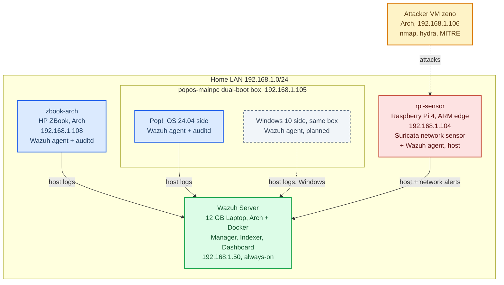

# Wazuh SOC Home Lab — Nazmus Sakib

**Owner:** Nazmus Sakib (23-52638-2) | AIUB BSc CSE Final Year  
**Started:** June 2026 | **Target completion:** Aug 31, 2026  
**Purpose:** Internship portfolio (SOC Analyst / Security Analyst) + Thesis foundation

---

## Project Goal

Build a functional Security Operations Center (SOC) home lab using Wazuh SIEM, demonstrating real-world threat detection, incident response, and detection engineering skills — entirely on personal hardware.

---

## Architecture



The lab runs on real personal hardware. `zbook-arch` and the Pop!_OS side of the dual-boot box are Active Linux agents reporting endpoint telemetry via auditd; the Raspberry Pi additionally runs Suricata for network-layer detection and forwards `eve.json` alerts — two vantage points (host + network). The Windows agent comes from the **same dual-boot machine** booted into Windows 10 (planned, dashed). The `zeno` attacker VM generates real on-wire attacks against the sensor.

---

## Hardware Inventory

| Device | Role | Specs | Status |
|---|---|---|---|
| 12 GB Laptop (Arch) | Wazuh Server (SIEM), Docker 4.14.5, `192.168.1.50` | 12GB RAM, always-on | **Active** |
| `zbook-arch` (HP ZBook, Arch) | Linux Agent + auditd | 32GB RAM, `192.168.1.108` | **Active** |
| `popos-mainpc` — dual-boot box, Pop!_OS 24.04 side | Linux Agent + auditd | 16GB RAM, `192.168.1.105`, always-on | **Active** |
| `popos-mainpc` — Windows 10 side (same machine) | Windows Agent | booted into Windows 10 | Planned |
| `rpi-sensor` (Raspberry Pi 4) | Network Sensor (Suricata 6.0.1) + Agent | 4GB RAM, `192.168.1.104` | **Active** |
| `zeno` (Arch VM) | Attacker (offensive) | VirtualBox, `192.168.1.106` | **Active** |

> The original Wazuh server (a VirtualBox VM) was decommissioned 2026-06-16 and **rebuilt 2026-06-17** as Docker single-node (Wazuh 4.14.5) on the always-home Arch laptop at `https://192.168.1.50` — dashboard, indexer (green), and 3 Active agents verified up. See `docs/Server_Rebuild_Journal_2026-06-17.md`.

---

## Phase Overview

| Phase | Focus | Status | Target |
|---|---|---|---|
| Phase 0 | Environment Setup | Done | Done |
| Phase 1 | Wazuh Deployment | Done | Done |
| Phase 2 | Log Ingestion (3 nodes) | Done | Done |
| Phase 3 | Threat Simulation | In Progress — first detection confirmed | June 28 |
| Phase 4 | Detection Engineering | Rules drafted (6, in `rules/`); deploy + prove pending | July 18 |
| Phase 5 | Investigation Playbooks | 1 report done, 2 drafted | Aug 1 |
| Phase 6 | Portfolio Documentation | In Progress | Aug 20 |
| Phase 7 | Raspberry Pi — Network Sensor | ✅ Done 2026-06-17 | June 21 |

> Phase 7 (RPi + Suricata) finished early, in parallel with Phase 3. Phase 4 custom rules are written and committed in `rules/local_rules.xml`; each needs to be deployed to the manager, validated with `wazuh-logtest`, and proven to fire — see `phases/phase4_detection_engineering/README.md`.

---

## Folder Structure

```
cyber-security-soc-lab/
├── README.md                          ← this file
├── PROJECT_STATUS.md                  ← current progress tracker
├── .github/workflows/validate.yml     ← CI: rule-XML + glyph + key-doc checks
├── docs/
│   ├── SOC_Lab_Project_Plan.md        ← master plan (full timeline)
│   ├── Server_Migration_Runbook.md    ← rebuild the Wazuh server (Docker on Arch)
│   ├── Signature_Project_Detection_Gap.md  ← the focused detection-gap case study
│   ├── Server_Rebuild_Journal_2026-06-17.md       ← Step 0 build log: every failure + fix
│   ├── Detection_Engineering_Journal_2026-06-17.md ← Phase 4 rule deploy/validate: every failure + fix
│   ├── guides/
│   │   ├── Blue_Team_Home_Lab_Guide.md
│   │   ├── Blue_Team_Lab_Phases_2-7_Complete_Guide.md
│   │   └── Quick_Command_Reference.md
│   ├── archive/
│   │   └── UNVERIFIED_Full_Implementation_Guide.md  ← quarantined AI draft, do not rely on
│   └── references/
│       ├── Architecting_Blue_Team_Home_Lab.pdf
│       └── Beyond_Alert_Chasing.pdf
├── phases/
│   ├── phase3_threat_simulation/
│   ├── phase4_detection_engineering/
│   ├── phase5_investigation_playbooks/
│   ├── phase6_portfolio/
│   └── phase7_raspberry_pi/           ← RPi + Suricata setup guide
├── incidents/                         ← incident reports (+ report template)
├── rules/                             ← custom Wazuh detection rules (local_rules.xml)
└── portfolio/
    └── screenshots/                   ← dashboard screenshots for CV/LinkedIn
```

---

## Portfolio Value

This lab demonstrates:
- Wazuh SIEM deployment and management (Docker single-node, rebuilt from scratch)
- Multi-host agent configuration with auditd host telemetry (3 Active Linux nodes; a Windows agent planned on the dual-boot box)
- Network-based intrusion detection (Suricata on an ARM edge device, host + network vantage)
- Custom detection-engineering: 6 MITRE-tagged Wazuh rules (XML), each tracing to a measured gap
- Incident investigation and report writing (PH3-001 confirmed; PH3-002/003 in flight)
- Real on-wire threat simulation (nmap recon, stealth-scan gap test, hydra SSH brute force)

Directly targeted at: **SOC Analyst**, **Security Analyst**, **Junior Cybersecurity roles** in Bangladesh.

---

## Links

- Master Plan: `docs/SOC_Lab_Project_Plan.md`
- Current Status: `PROJECT_STATUS.md`
- Custom detection rules: `rules/local_rules.xml` · Phase 4 workflow: `phases/phase4_detection_engineering/README.md`
- Incident reports: `incidents/` (PH3-001 nmap · PH3-002 brute force · PH3-003 stealth-scan gap)
- RPi sensor (as-built): `phases/phase7_raspberry_pi/Phase7_Suricata_LIVE_Runbook.md`
- Build journals (failures + fixes): `docs/Server_Rebuild_Journal_2026-06-17.md` · `docs/Detection_Engineering_Journal_2026-06-17.md`
- Quick Commands: `docs/guides/Quick_Command_Reference.md`
