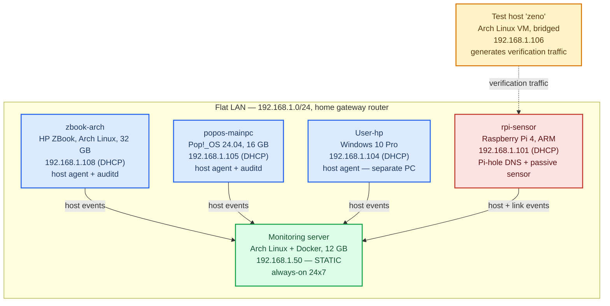

# Multi-OS Home Network — Operations, Monitoring and Troubleshooting Lab

**Operator:** Nazmus Sakib — AIUB, BSc Computer Science and Engineering
**Running since:** June 2026 | **Last verified:** 2026-06-19

A single flat LAN (`192.168.1.0/24`) of **6 hosts across 4 operating systems**, built and operated on personal hardware. Everything here is real: the addressing, the DNS, the firewall policy, the faults, and the fixes. This repository is the operational record — topology, host inventory, a numbered troubleshooting log, runbooks, and the monitoring stack that watches it all.

It runs 24x7. One host is an always-on monitoring server; one is a Raspberry Pi acting as a passive traffic sensor. Every configuration change reaches the running server through a pull request with CI validation, across 41 commits.

---

## Network topology



**Addressing.** DHCP for endpoints, with the monitoring server pinned static at `.50`, outside the pool. That static reservation was not the original design — it is the fix for a real fault, logged below. There are no VLANs, no managed switch and no port forwarding; this is deliberately a LAN-only network.

**DNS.** Pi-hole (dnsmasq) on the Raspberry Pi serves resolution and filtering network-wide.

**Firewall posture,** verified by external port scan on 2026-06-19: the Windows and Arch hosts are fully filtered, default-deny, no reachable service. The Pi deliberately exposes SSH, DNS and VNC. No unauthenticated remote-code-execution path exists anywhere on the LAN.

---

## Host inventory

| Host | Role | Address | OS | Status |
|---|---|---|---|---|
| (monitoring server) | Always-on log and event server, Docker | `192.168.1.50` **static** | Arch Linux, 12 GB | Active |
| `zbook-arch` | Workstation, host agent + auditd | `192.168.1.108` | Arch Linux, 32 GB | Active |
| `popos-mainpc` | Main workstation, host agent + auditd | `192.168.1.105` | Pop!_OS 24.04, 16 GB | Active |
| `User-hp` | Windows endpoint, host agent | `192.168.1.104` | Windows 10 Pro | Active |
| `rpi-sensor` | Pi-hole DNS, passive traffic sensor, host agent | `192.168.1.101` | Raspberry Pi OS (Debian), 4 GB ARM | Active |
| `zeno` | Test host, generates verification traffic | `192.168.1.106` | Arch Linux VM, bridged | Active |

> **Addresses drift.** These are DHCP leases, not reservations. `rpi-sensor` moved from `.104` to `.101` on its own and the Windows box took `.104` — which is exactly why older diagrams in this repo disagree with this table, and why router-side DHCP reservations are on the to-do list. Trust this table and `PROJECT_STATUS.md`, not the archived docs.

---

## Troubleshooting log — the faults, and how they were found

The full log is `docs/TROUBLESHOOTING_LOG.md`: roughly 30 numbered entries, each written as **Symptom, Root cause, Fix, Lesson**. A representative selection:

| Fault | Root cause | How it was isolated |
|---|---|---|
| Raspberry Pi `eth0` dead, port LEDs lit | Layer 1 — `NO-CARRIER`, no link partner negotiated | Ruled out DHCP and IP config as Layer-3 red herrings using `ip link` and `ip -br a`; failed the sensor over to `wlan0` to restore monitoring in the same session |
| A single host lost its path | Switch-port renegotiation flap | Tested gateway and server reachability from the affected machine first, establishing it was one host — not a LAN-wide outage worth escalating |
| Agent-to-server connectivity breaking silently and repeatedly | DHCP address drift on the monitoring server | Moved the server to a static address outside the pool and published a fixed addressing scheme for all 6 hosts |
| Unidentified host on the LAN | Unknown device, mDNS `.local` resolution failed | ARP sweep plus MAC OUI lookup — identified as a phone with a randomised MAC |
| Virtual machine unreachable from peer hosts | Hypervisor adapter set to NAT, not bridged | Corrected the adapter so the guest obtained an address in the correct subnet |
| Always-on server threatened by a full 32 GB root filesystem | Container data-root and container store both on `/` | Relocated both to a larger filesystem via symlinks, no data loss; prevented recurrence with journald vacuuming and log rotation |
| Terminal and SSH sessions failing across hosts | `TERM`/terminfo mismatch — not a network fault at all | Eliminated the network as a cause before touching it |

Full build journals, including every failure and its fix: `docs/Server_Rebuild_Journal_2026-06-17.md` and `docs/Detection_Engineering_Journal_2026-06-17.md`.

---

## Monitoring and visibility

- **Central log and event platform** — Wazuh 4.14.5, Docker single-node, with **4 agents across 4 operating systems** reporting in, plus indexer and dashboard. `restart: always`, survives reboot.
- **Passive network traffic sensor** — Suricata 6.0.1 on the Raspberry Pi, running a 50,685-rule vendor set, forwarding structured JSON events to the central platform. Host and network vantage points, one console.
- **Host and service inventory** — `nmap` discovery sweeps plus full TCP service and version scans, recording per-host open ports and service versions.
- **Rotating packet capture** — `tcpdump` on the sensor.
- **File-integrity watches** — `auditd` on the Linux hosts, tuned after an over-broad watch produced a 31,751-event flood (the `passwd` read watch was the cause; changed from `rwa` to `wa`).
- **Flow export** — nProbe Enterprise (permanent academic licence from ntop) installed, with a 41-field NetFlow/IPFIX template designed. **Not yet run.**

**Change control.** `main` is branch-protected. Every change goes through a pull request, and GitHub Actions validates every rule file before it can reach the running server — see `.github/workflows/validate.yml`.

---

## Alert rules and coverage testing

Seven custom alert rules (`100015`-`100021`) are live in `rules/local_rules.xml`, each traced to a measured gap, and each proven firing against real traffic on 2026-06-18. One custom traffic signature (`sid:9000020`) was written for VNC, because the vendor ruleset carried no VNC coverage at all.

The negative results are documented as carefully as the positive ones, because honest can-see / cannot-see reporting is the point of a monitoring stack:

- A slow-timed scan produced **zero** alerts — a full evasion of the vendor signatures, since payload-free SYN packets carry no application-layer content to match. Written up as a known limitation with a recommended fix, in `incidents/phase3_stealth_scan_gap_report.md`.
- Rule `100018` missed on its first parallel run — a race between the success event and the failure threshold, not a rule defect.
- Rule `100020` is permanently shadow-blocked by `100015` on the same parent, which is why `100021` exists.

Written up as **3 incident records** and **2 investigation playbooks**, with 21 screenshots evidencing each result in `portfolio/screenshots/phase4/`.

---

## Repository layout

```
network-ops-lab/
├── README.md                          <- this file
├── PROJECT_STATUS.md                  <- current state, verified per date
├── .github/workflows/validate.yml     <- CI: rule XML + doc checks on every PR
├── docs/
│   ├── TROUBLESHOOTING_LOG.md         <- ~30 faults: Symptom / Root cause / Fix / Lesson
│   ├── Server_Rebuild_Journal_2026-06-17.md      <- build log, every failure and fix
│   ├── Detection_Engineering_Journal_2026-06-17.md
│   ├── Server_Migration_Runbook.md    <- rebuild the server from scratch
│   ├── Agent_Enrollment_Handover.md   <- per-OS onboarding runbooks
│   ├── Windows_Agent_Setup_Runbook.md
│   ├── guides/                        <- setup guides, quick command reference
│   ├── archive/                       <- quarantined early draft, do not rely on
│   └── references/                    <- background PDFs
├── phases/                            <- build phases 3-8, each with its own runbook
├── incidents/                         <- incident records + template
├── rules/                             <- custom alert rules (local_rules.xml)
└── portfolio/screenshots/             <- 21 screenshots, positive and negative results
```

---

## Where to start reading

| If you want | Read |
|---|---|
| The faults and how they were diagnosed | `docs/TROUBLESHOOTING_LOG.md` |
| Current verified state of every host | `PROJECT_STATUS.md` |
| How the server was built, and what broke | `docs/Server_Rebuild_Journal_2026-06-17.md` |
| How a new host gets onboarded | `docs/Agent_Enrollment_Handover.md` |
| The sensor as built | `phases/phase7_raspberry_pi/Phase7_Suricata_LIVE_Runbook.md` |
| Alert rules and what they cover | `rules/local_rules.xml`, `phases/phase4_detection_engineering/README.md` |
| Everyday commands | `docs/guides/Quick_Command_Reference.md` |

---

## Still open

- Windows endpoint telemetry (Sysmon) — plan written at `phases/phase8_windows_endpoint_detection/PLAN.md`, not executed.
- Router-side DHCP reservations, so host addresses stop drifting.
- `popos-mainpc` agent version drift (v4.14.4 against a v4.14.5 manager).
- One stale disconnected agent to remove.
- NetFlow/IPFIX export via nProbe — licensed and installed, not yet run.
